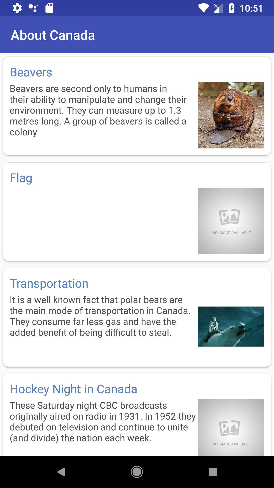

Android : RecyclerView Demo
============================
This application is an example of usage [Retrofit 2](http://square.github.io/retrofit/),[EventBus](http://greenrobot.org/eventbus/) and 
[Room Persistence Library](https://developer.android.com/topic/libraries/architecture/room)

Goals
--------
- Display JSON data in a RecyclerView 
- Support for REST API using Retrofit(Type-safe HTTP client for Android) library
- Support for database event using Event Bus library
- Room Persistence Library for fluent database access
- Support for Screen orientation changes and all the negative scenarios  

Testing 
--------
- Android User Interface testing using [Espresso](https://developer.android.com/training/testing/espresso/)
- Unit Testing by creating and configuring mock objects using [Mockito Framework](https://github.com/mockito/mockito)

Material Design Usage and other Libraries
------------------------------------------
- Use of RecyclerView, CardView and Toolbar
- [Picasso](http://square.github.io/picasso/) for hassle-free image loading in application
- [OkHttp-logging-interceptor](https://github.com/square/okhttp/tree/master/okhttp-logging-interceptor) An OkHttp interceptor which logs HTTP request and response data

Screen
---------
